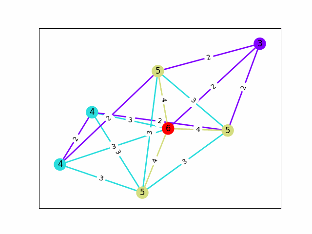
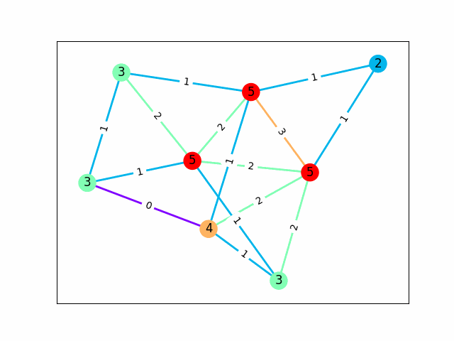

# cops-and-robbers
## Usage
Program can used by running [src/main.py](src/main.py). Users can use the command line interface to construct graphs (mangually or using generators), save and load graphs from file, and of course check if graphs are cop-win or robber win. More specifically, users have the following options:

| Command | Description |
|---|---|
| q | Quit |
| h | Print menu |
| c | Check if the current graph is cop-win. A visualization of the algorithm will be saved to greedy_algorithm.gif|
| d | Display the current graph |
| n | Add node |
| e [n1] [n2] | Add edge between n1 and n2 |
| r [n1] [n2] | Remove edge between n1 and n2 |
| s [path] | Save graph to path |
| l [path] | Load graph from path |
| co [n] | Construct the complete graph of size n |
| ra [n] [m] [seed] | Construct a random graph with order n amd size m |
| de [sequence] [seed] | Construct a graph given a [degree sequence](https://networkx.org/documentation/stable/auto_examples/graph/plot_degree_sequence.html) |
| ga [i] | Construct the ith graph in the [graph atlas](https://networkx.org/documentation/stable/auto_examples/graphviz_layout/plot_atlas.html) (all connected graphs up to 6 nodes) |

Here is an example usage of the program (constructing a 4-cycle):
```bash
python .\src\main.py
MENU:
        q - quit; h - print menu; c - check if cop-win
        n - add node; e [NODE1] [NODE2] - add edge; r [NODE1] [NODE2] - remove edge
        d - draw graph; s [NAME] - save graph; l [NAME] - load graph
        co [n] - complete graph; ra [n] [m] [seed] - random graph; de [sequence] [seed] - degree sequence; ga [i] - graph atlas
e 0 1
Added edge from 0 to 1
e 1 2
Added edge from 1 to 2
e 2 3
Added edge from 2 to 3
e 3 0
Added edge from 3 to 0
d
Drawing graph. Close window to continue editing the graph.
c
Graph IS NOT cop-win. Visualization of algorithm is saved at greedy_algorithm.gif
q
```

### Example Outputs
Cop-win Graph  


Robber-win Graph  

